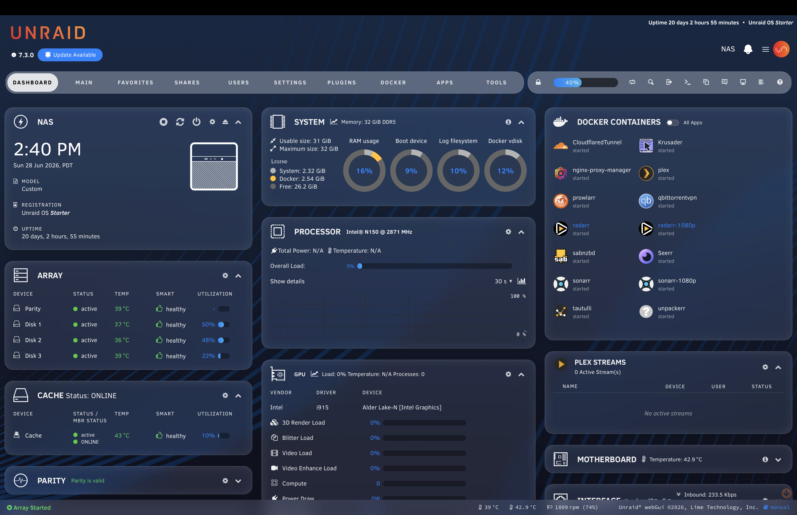
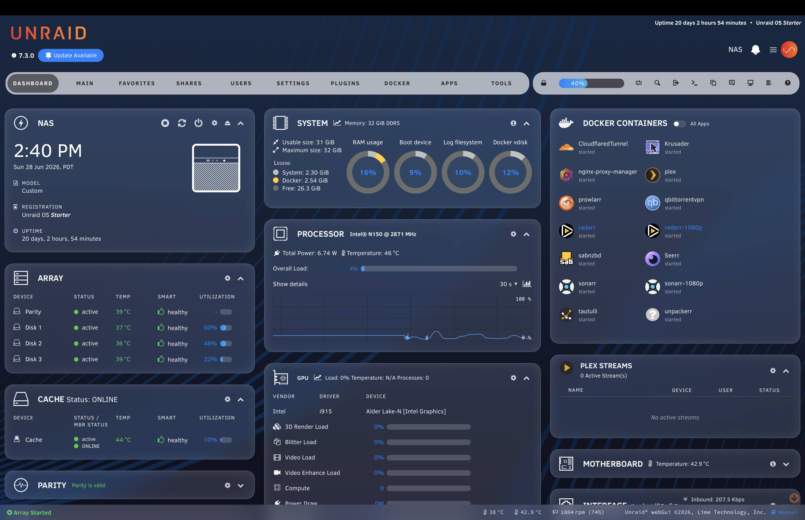

# Unraid Glass

A custom CSS theme for the Unraid web UI with a liquid glass aesthetic — frosted glass panels, blurred backgrounds, Apple-system color palette, and pill-shaped controls.




---

## Features

- **Glass panels** — frosted tile surfaces with backdrop blur and specular edge lighting
- **Custom background** — fixed wallpaper image with parallax-style glass overlay
- **Apple color palette** — system green, blue, orange, red, teal throughout
- **Pill buttons & tabs** — rounded controls on every form, dialog, and nav element
- **Themed navigation** — floating frosted nav tiles with active/hover states
- **Styled popups** — SweetAlert confirmation dialogs and nchan update output styled to match
- **Docker panel** — iOS-style toggle switches, clean row layout
- **Community Apps** — glass card panels, Apple-colored ribbons, themed buttons
- **Light & dark mode** — full support for both via `prefers-color-scheme`
- **Mobile responsive** — stacked nav tiles, adaptive layouts for small screens

---

## Dependencies

### Required

| Plugin | Purpose |
|--------|---------|
| [Custom.CSS](https://forums.unraid.net/topic/46403-plugin-ca-custom-css-javascript/) | Injects the CSS and hosts the background image |

Install **Custom.CSS** via Community Applications (search `Custom CSS`).

### Optional but Recommended

| Plugin | Purpose |
|--------|---------|
| [Community Applications](https://forums.unraid.net/topic/38582-plug-in-community-applications/) | Styled app cards, ribbons, and search UI |
| [DashStats](https://forums.unraid.net/topic/139996-plugin-dashstats/) | The dashboard widget panels this theme is designed around |

---

## Installation

### 1. Install the Custom.CSS plugin

Search for **Custom CSS** in Community Applications and install it.

### 2. Add a background image

Place your wallpaper at:

```
/boot/config/plugins/custom.css/assets/bg.jpg
```

Any image works. Landscape photos or abstract gradients look best. The theme works without one (falls back to a dark navy `#152843` base color).

### 3. Install the theme CSS

Copy `unraid-glass.css` to your Unraid server and paste its contents into the Custom.CSS plugin's CSS field:

**Main menu → Settings → Custom CSS**

Paste the full contents of `unraid-glass.css` into the CSS box, then click **Apply**.

Alternatively, if you prefer file-based management, place the file at:

```
/boot/config/plugins/custom.css/custom.css
```

### 4. Reload the Unraid web UI

Hard-refresh your browser (`Cmd+Shift+R` / `Ctrl+Shift+R`) to clear the stylesheet cache.

---

## Customization

All colors and surface values are CSS variables defined at the top of the file under `:root`. You can override any of them without touching the rest of the stylesheet.

### Key variables

```css
:root {
  --custom-theme-accent:          #f97316;  /* orange accent */
  --custom-theme-nav-line:        #30D158;  /* green active indicator */
  --custom-dashboard-tile-bg:     rgba(200, 200, 200, 0.12);
  --custom-dashboard-tile-blur:   20px;
  --custom-dashboard-tile-radius: 18px;
}
```

### Light mode

Light mode overrides are in the `@media (prefers-color-scheme: light)` block. The theme switches automatically based on your OS or browser preference.

---

## Compatibility

Tested on **Unraid 7.x** with Chrome/Chromium-based browsers. Firefox is supported but `backdrop-filter` blur rendering may differ slightly on older versions.

---

## License

MIT
